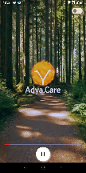
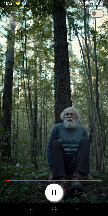
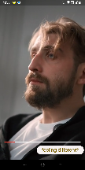
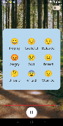
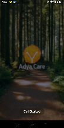

## Documentation  
  
### Installation Instructions  
  
To install and run the Flutter Non-Linear Video Session System, please follow these steps:  
  
1.  Ensure that you have Flutter and Dart SDK installed on your system. If not, please refer to the [Flutter Installation Guide](https://flutter.dev/docs/get-started/install) for instructions.  
  
2.  Clone the project repository from GitHub using the following command:  
    bash

- `git clone https://github.com/shamith16/adya-app.git`
  
-   Open the project in your preferred IDE or text editor.  
  
-   Run the following command in the terminal to fetch and download the project dependencies:  
  
- `flutter pub get`  
  
-   Connect your Android or iOS device to your development machine or use an emulator.  
  
-   Build and run the application using the following command:  
  
    arduino  
  
  
1. `flutter run`  
  
    This command will automatically compile the Flutter code and launch the application on the connected device or emulator.  
  
  
### System Architecture  
  
The Flutter Non-Linear Video Session System follows a layered architecture to ensure separation of concerns and maintainability. The architecture consists of the following key components:  
  
1. **Presentation Layer**: Responsible for handling the user interface and user interactions. It includes the three screens: Splash Screen, Home Screen, and Player Screen.  
  
2. **Data Layer**: Handles data management, including fetching video assets from local storage and streaming videos from network URLs. The constants.dart file contains the URLs for network videos.  
  
3. **State Management**: Utilizes the `get` package for state management, allowing for efficient state updates and UI rendering.  
  
  
### Features and Functionality  
  
The Flutter Non-Linear Video Session System provides the following features:  
  
1.  Splash Screen:  
  
    -   A simple screen displayed at the start of the application.  
    -   Includes a "Get Started" button to proceed to the Home Screen.  
  
2.  Home Screen:  
  
    -   Displays an introduction video upon entering the screen.  
    -   At the end of the video, presents a dialog with multiple emoji options representing different feelings.  
    -   Allows the user to select an emoji, which dynamically changes the video playing on the screen.  
    -   Includes a switch in the top-right corner to enable playing videos in a separate Player Screen.  
  
3.  Player Screen:  
  
    -   Displays the selected video based on the emoji chosen in the Home Screen.  
    -   Includes playback controls such as play, pause, and seek functionality.  
    -   Provides a "Feeling Different?" button to navigate back to the Home Screen, where the emoji dialog is still visible for selecting another emotion.  
  
### Usage Guidelines  
  
To use the Flutter Non-Linear Video Session System effectively, please follow these guidelines:  
  
1.  Upon launching the application, the Splash Screen will be displayed. Tap the "Get Started" button to proceed to the Home Screen.  
  
2.  On the Home Screen, an introduction video will automatically start playing. Watch the video until the end.  
  
3.  After the video ends, a dialog with emoji options will appear. Tap on an emoji that represents your current feeling or emotion.  
  
4.  The video playing on the Home Screen will change based on your emoji selection. You can watch the updated video on the Home Screen.  
  
5.  To play a video in a separate Player Screen, enable the switch located in the top-right corner of the Home Screen.  
  
6.  In the Player Screen, the selected video will be played. You can control the playback using the provided controls (play, pause, seek).  
  
7.  If you want to choose a different emotion or feeling, tap the "Feeling Different?" button in the Player Screen. It will navigate you back to the Home Screen, where you can select another emoji and watch a new video.  
  
8. To stream video from internet permission is added in AndroidManifest.xml  
  
  
### Modifying the Application  
  
If you wish to modify or extend the Flutter Non-Linear Video Session System, consider the following aspects:  
  
1.  To customize the user interface or add new features, explore the relevant code files in the project.  
  
2.  For integrating new videos, modify the Constants.dart file by adding the necessary video URLs.  
  
3.  To enhance the non-linear session logic, refer to the code sections related to emoji selection and video playback.  
  
  
  
### Screenshot

 &nbsp;  &nbsp;  &nbsp;  &nbsp; 

